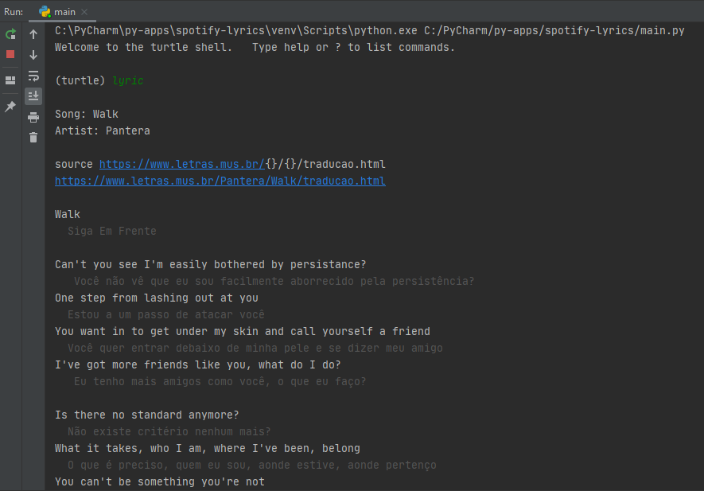
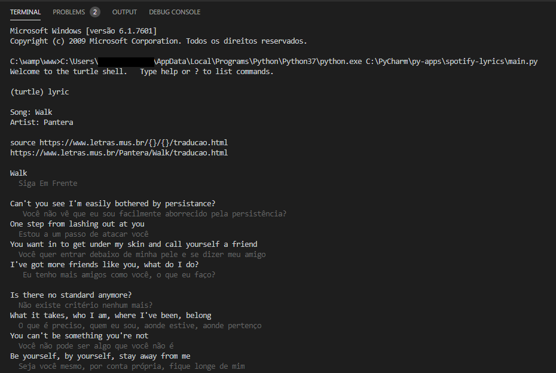
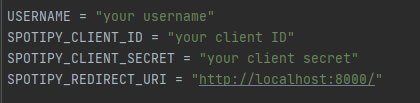

# Spotify Lyrics Translator
Lista a letra original e abaixo a tradução da música que está sendo tocada no usuário do Spotify conectado.

####Exemplos:

* No terminal do PyCharm


* No terminal do Visual Studio Code


# Instalar
**Nota:** Testado com Python 3.7 no Windows 7 

Clone/download este repositório e execute no console:
```
setup.bat
```
ou instale manualmente:
```
pip install spotipy
pip install unidecode
pip install beautifulsoup4
pip install colorama
```

# Configuração

* Cadastre-se e crie um novo aplicativo em https://developer.spotify.com
* pegue as informações e preencha as linhas abaixo (encontrado no inícío de main.py) com as informações da sua conta recém criada



# Uso
Execute o seguinte comando no terminal 
```
python main.py
```
ou crie um arquivo .bat, e se preferir envie-o como atalho na área de trabalho
```
[caminho do python]\Python\Python37\python.exe [caminho do clone do github]\spotify-lyrics-translator\main.py
```

# Comandos

```lyric``` ou ```lyric artist - song``` exibe a letra com tradução da música atual do Spotify

```play``` inicia música

```pause``` pausa música

```next``` próxima música

```previous``` música anterior

```current``` música atual

```devices``` lista dispositivos conectados ao Spotify

```recent``` ou ```recent 2``` lista as músicas tocada recentemente

```exit``` fecha o console

# Referências

* https://spotipy.readthedocs.io/
* https://github.com/kennycontreras/spotify-lyrics
